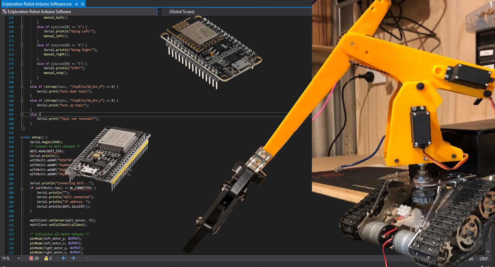

# IoT Exploration Robot
### 🌅 Overview
High School (Year 12) VET Integrated Technologies Project by Liam Price. A robot tank that can be controlled with computer steering wheel and foot pedal peripherals through the internet via cellular connectivity (4G). This repository houses the Arduino software that runs on the physical robot, the control panel software can be found in my other repository [here](https://github.com/LeehamElectronics/Exploration-Robot-Control-Panel). Below is general information about this project, scroll to the bottom for more information related to the Arduino software solution.

### 🤖 Physical Build Details
The physical build consists of a metal chassis purchased online, 4x 12V DC motors, a plastic cut-out crane mechanism with a 3D printed claw, 2x 12V Lithium-ion batteries, 5x servo motors, LED lights, LCD Panel, Espressif ESP32 development board, L298N H Bridge motor driver, buck converters, MPU6050 Gyro, and other assorted electrical equipment. You can view the school project engineering folio on Google Drive [here](https://drive.google.com/file/d/1ohp7j_BZnhxLjLv0mqf6PKU2e-KAmkB1/view?usp=sharing). And the [YouTube video](https://www.youtube.com/watch?v=0TiRYpMsIOc&t=27s) can be found here.

### 💻 Software Overview
Built with Visual Micro in Visual Studio 2019. The libraries used are ESP32 WiFi, WifiManager, PubSubClient (MQTT), ArduinoJSON, EEPROM, U8glib, ESP32Servo, and the Arduino library.
The main c++ program can be found in the .ino file and the header files are located in the include folder. You can also find the electrical schematic files in this repository.

### 🤔 Current Status
I originally built this robot for a school project (Year 12 VCE VET) for my Integrated Technologies class. Now I use it at home as a remote controlled drone for assorted tasks such as closing small gates, investigating enclosed areas around my property that are not visible via CCTV, and other house-hold related tasks like chasing the cat around. Towards the end of my school project in the eventful year of 2020, my project won the 2021 VCE Top Designs competition here in Victoria, Australia. The "Exploration Robot" was showcased as part of the Top Designs exhibition in the Melbourne Museum, which you can view [online here](https://museumsvictoria.com.au/melbournemuseum/learning/top-designs-2021/). You can also view the article directly [here](https://museumsvictoria.com.au/melbournemuseum/learning/top-designs-2021/vce-vet-programs/integrated-technologies/) or watch the embarrassing interview they posted of me where I say 'umm' more than anything else [over here](https://www.youtube.com/watch?v=ty_FZUM7rPA)

### 📷 Photos and Videos

###### Credit to my awesome high school teacher Steve Donaldson for teaching me fundamentals in electronics / general technologies and Graeme Lipback for supporting me while I built this project at school!
